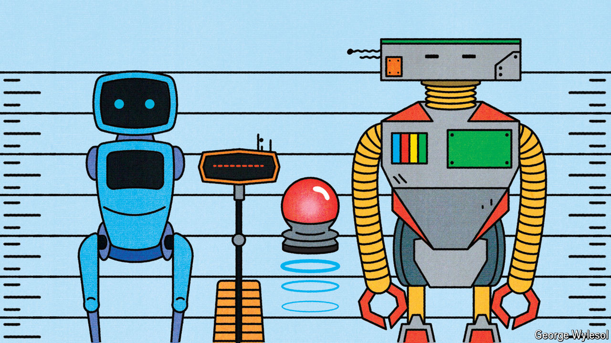

###### On your marks

# GPT, Claude, Llama? How to tell which AI model is best 

##### Beware model-makers marking their own homework 

 

> Jul 31st 2024 

When Meta, the parent company of Facebook, announced its latest open-source large language model (LLM) on July 23rd, it claimed that the most powerful version of Llama 3.1 had “state-of-the-art capabilities that rival the best closed-source models” such as GPT-4o and Claude 3.5 Sonnet. Meta’s announcement included a table, showing the scores achieved by these and other models on a series of popular benchmarks with names such as MMLU, GSM8K and GPQA. 

