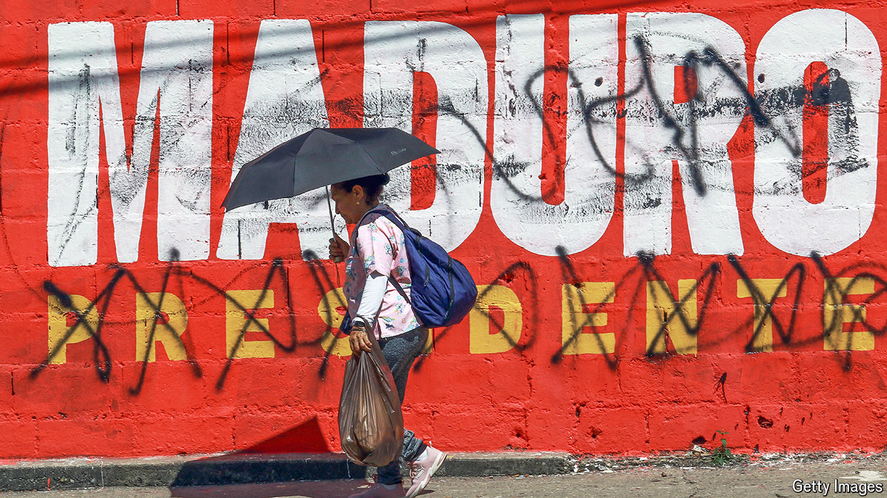

###### Venezuela’s regime digs in

# After protests over a stolen election, the goons crack heads 

##### Yet the brazenness of Nicolás Maduro’s theft crosses a line 

 

> Aug 1st 2024 

ONLY ONE reason prevails for why Nicolás Maduro ever became Venezuela’s president. It was not his skill at winning elections. Nor his willingness to steal them. It was certainly not his oratory. It was simply that his charismatic predecessor, Hugo Chávez, who had cancer, appointed him as heir. In the build-up to Venezuela’s latest presidential election, held on July 28th (Chávez’s 70th birthday), a video of the late populist announcing his decision, in 2012, was broadcast repeatedly as a kind of talisman.

