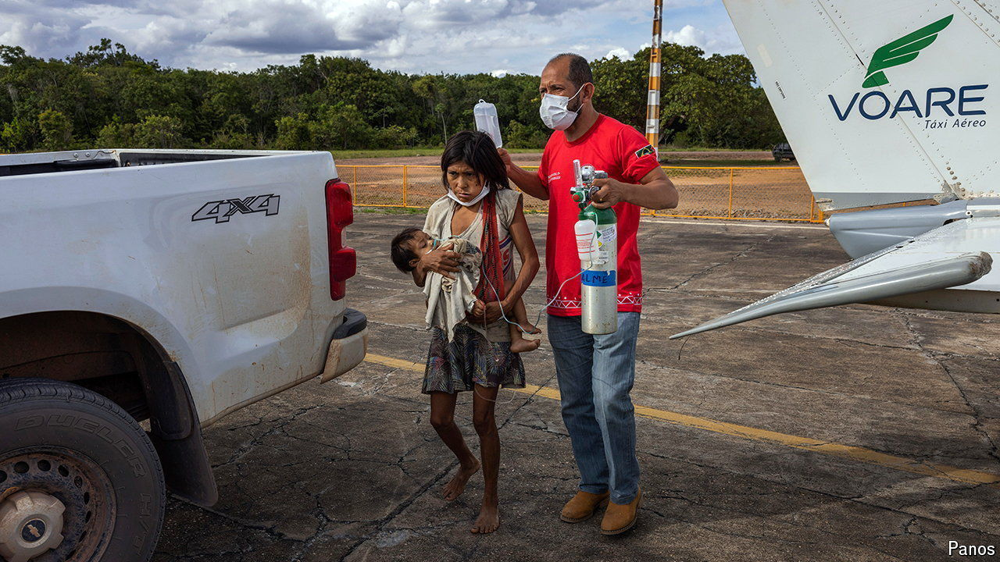

###### Help needed

# The plight of Brazil’s indigenous groups worsens 

##### Blame illegal miners, ranchers, loggers, traffickers and an unsympathetic Congress 

 

> Aug 1st 2024 

Since PORTUGUESE colonisers first appeared, the story of indigenous Brazilians has been littered with horror. Disease and violence killed many after the conquest. Slavery on rubber plantations existed into the 20th century. Today wildcat miners, ranchers and loggers are the threat to the indigenous peoples of Brazil.

