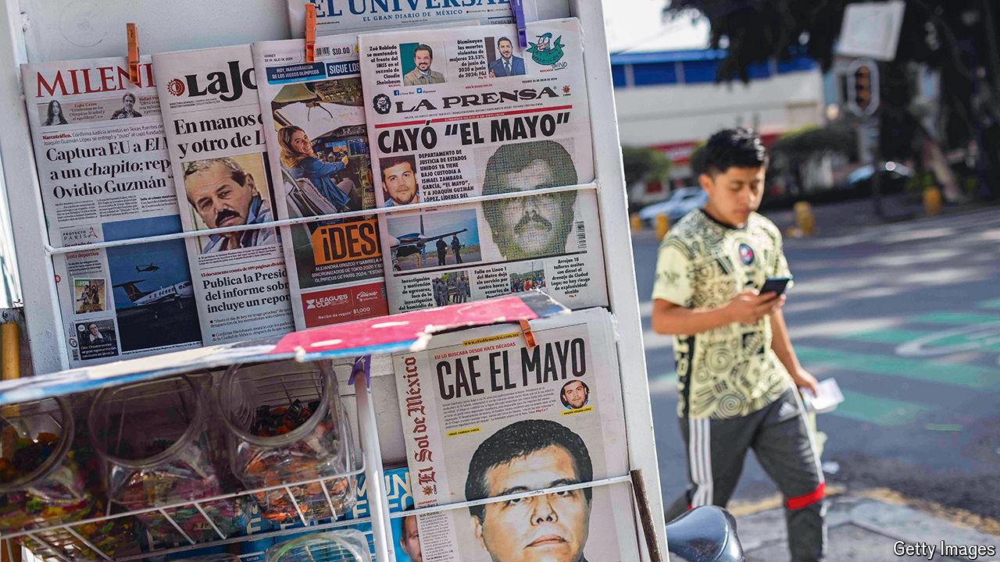

###### Mexico’s drug gangs

# Will El Mayo’s arrest slow the spread of fentanyl? 

##### The United States nets a very big fish 

 

> Aug 1st 2024 

Ismael “EL mayo” zamBada is far less well-known than his fellow founder of Mexico’s Sinaloa Cartel, Joaquín Gúzman, or “El Chapo”. With his daring prison escapes and a craving for notoriety, El Chapo became the face of the gang, until his capture in 2016 and his incarceration for life in a “supermax” prison in the United States. Yet for all his low-key manner, El Mayo was every bit as important in building the Sinaloa operation into a vast and violent drugs and money-laundering syndicate. Its connections ran deep into Mexico’s political establishment and it controlled the lion’s share of the North American market for illegal drugs. It was therefore a stunning coup when the United States arrested Mr Zambada on July 26th along with one of El Chapo’s four sons, Joaquín Gúzman López, in Texas.

