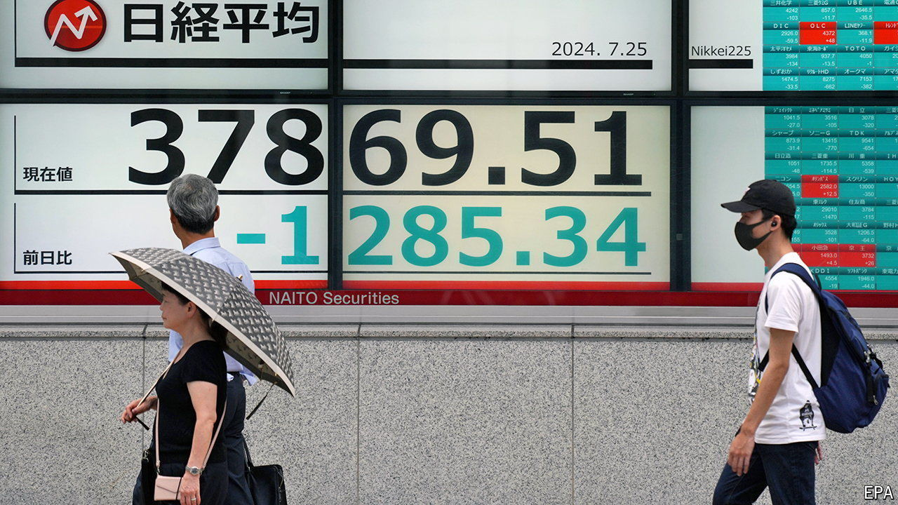

###### The world this week

# Business 

#####  

 

> Aug 1st 2024 

The  raised its benchmark interest rate for only the second time in 17 years, to 0.25% (it increased the rate in March for the first time since 2007). It also plans to reduce its ¥6trn ($39bn) monthly bond purchases by half by the spring of 2026. Japanese government officials had been uncharacteristically vocal in their desire to see the bank halt the decline of the yen. The weakened currency has fuelled inflation, which has remained above the bank’s 2% target for 27 months. 

