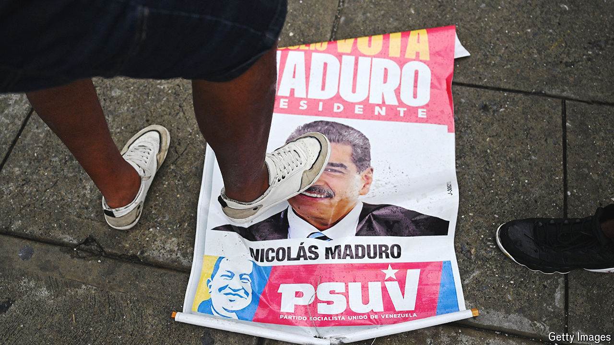

###### The world this week

# Politics 

#####  

 

> Aug 1st 2024 

At least 20 protesters were reportedly killed in clashes with police after Nicolás Maduro was declared the victor of  presidential election by the country’s electoral commission. The opposition says exit polling showed that its candidate, Edmundo González, was the clear winner in the high-turnout contest. It has been unable to obtain results from many polling stations. America called for the immediate publication of the precinct-level polling. Nine countries in the region, including Argentina and Peru, called an emergency meeting of the Organisation of American States, which said the vote was unreliable. China, Iran, North Korea and Russia congratulated Mr Maduro.

