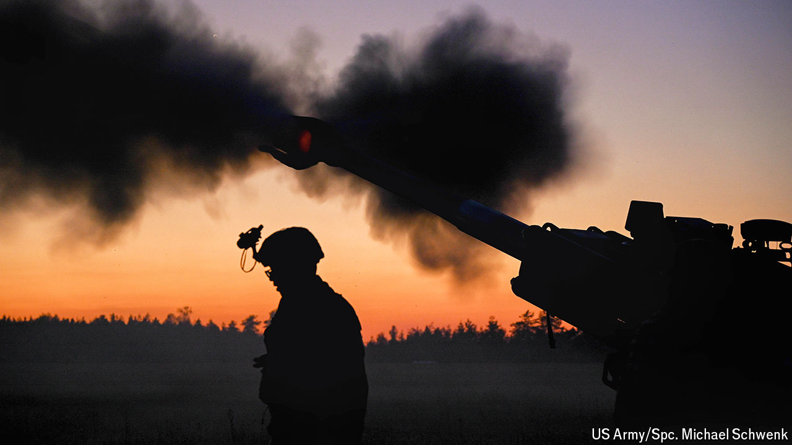

###### Red alert

# America is not ready for a major war, says a bipartisan commission 

##### The country is unaware of the dangers ahead and of the costs to prepare for them 

 

> Jul 29th 2024 

GENERAL CHARLES “CQ” BROWN, the chairman of the joint chiefs of staff, America’s top military officer, recently told the Aspen Security Forum, a gathering of the country’s foreign-policy elite, that the nation’s  were the “most lethal, most respected combat force in the world”. Steely-faced, and to jubilant whoops, he declared: “I do not play for second place.” 

