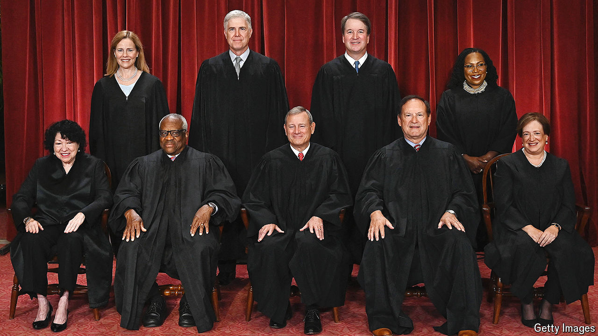

###### POTUS and SCOTUS

# How the election will shape the Supreme Court 

##### A second Trump administration could lock in a conservative supermajority for decades 

 

> Jul 30th 2024 

IN a speech  in Texas on July 29th President Joe Biden called for major changes to America’s highest court: term limits for the justices and an enforceable ethics code, plus a constitutional amendment scuttling the court’s recent decision broadly shielding former presidents from criminal prosecution. Kamala Harris, his vice-president and would-be successor, quickly endorsed the proposals. But Mike Johnson, the Republican speaker of the House of Representatives, accurately declared the plans “dead on arrival”. Republicans are disinclined to tinker with a Supreme Court delivering conservative victories. And the requisites for constitutional amendments—supermajorities of the states and in both houses of Congress—remain hopelessly out of reach. 

