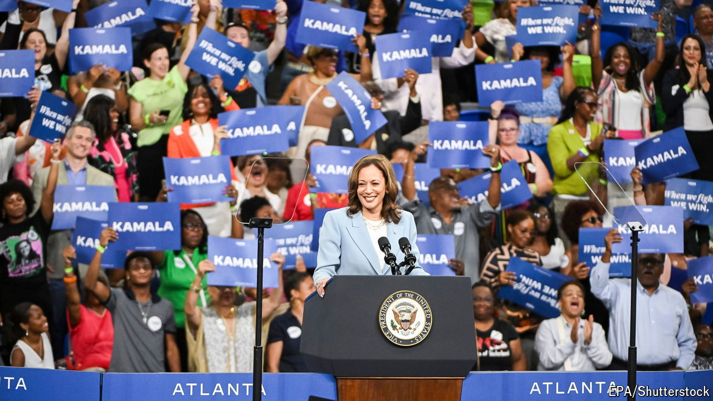

###### Campaign calculus

# The Kamala Harris effect on the polls has been dramatic 

##### The latest surveys point to a tightening race 

 

> Jul 31st 2024 

Joe Biden had been one of the most unpopular presidents to seek re-election since the advent of modern polling. In April 2023, when he declared his intention to run for a second term, some 41% of Americans said they approved of him. More than a year later, after his disastrous debate performance and calls from high-profile members of his own party for him to step aside, his approval rating sank to an all-time low of 37%.

