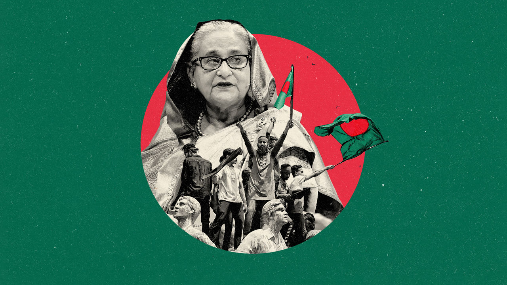

###### A second liberation

# Can hope beat hatred in Bangladesh? 

##### Domestic politics and great-power rivalries will make transitioning to democracy hard 

 

> Aug 7th 2024 

ON AUGUST 5th  was expecting to stand trial in absentia in Dhaka, Bangladesh’s capital, in a trumped-up corruption case that might have put him in prison for life. Two days later Mr Yunus, a Nobel laureate, economist and social entrepreneur, was appointed the head of Bangladesh’s army-backed interim government. Sheikh Hasina, the prime minister for 20 of the past 28 years, had  following weeks of student protests, which violent repression by state forces had failed to quash. The streets of Dhaka, previously patrolled by armed soldiers and police, were filled with students directing traffic and cleaning up buildings ransacked by looters, including the parliament. Overnight, years of autocratic rule had been replaced with hope for democratic renewal.

