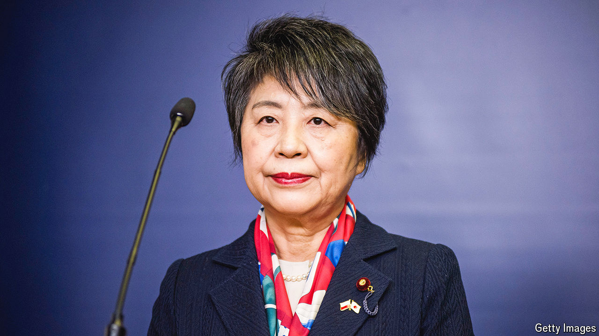

###### Is the future female?

# Could Kamikawa Yoko be Japan’s next prime minister? 

##### She would be the first woman to hold the top role 

 

> Aug 8th 2024 

WHEN UNNO Fumiko first met Kamikawa Yoko, she was left wondering: “Why would such an earnest person want to go into politics?” Ms Unno was a leader among the green-tea farmers of Shizuoka prefecture; Ms Kamikawa was a think-tank researcher, with no political connections, who wanted to enter parliament to represent the region. Having graduated from the University of Tokyo and Harvard University, Ms Kamikawa “could do anything”, Ms Unno thought. Politics, long the domain of men from political families, seemed “like a waste”. It took Ms Kamikawa seven years and two election cycles to win her first seat in Japan’s lower house, in 2000. Now Japan’s foreign minister, her career has been anything but a waste.

