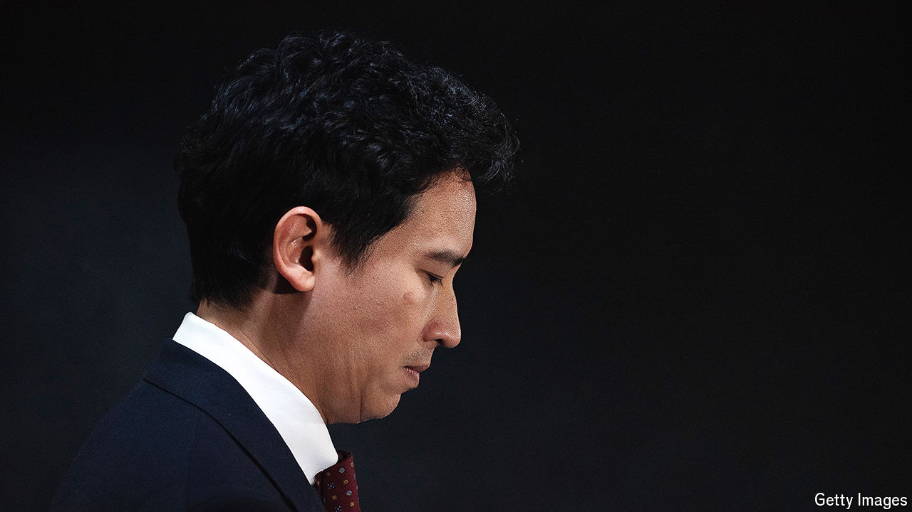

###### Democratic deficit

# Thailand’s top court tramples over the country’s democracy 

##### Pita Limjaroenrat and his Move Forward Party have been banned 

 

> Aug 7th 2024 

Thailand’s constitutional court made a predictably draconian move on August 7th. It dissolved the , a pro-democracy group which won a plurality of seats in last year’s election. The court ruled unanimously that the party’s proposal to reform the country’s harsh  law—which criminalises criticism of the royal family—posed a threat to Thailand’s constitutional monarchy. More damningly, it banned all of the party’s executives, including , its leader, from politics for a decade. 

