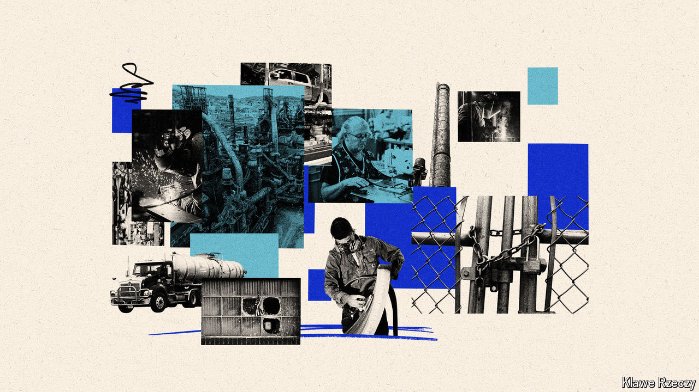

###### The left-behind

# America’s “left-behind” are doing better than ever 

##### But manufacturing jobs are still in decline 

 

> Aug 8th 2024 

REPUBLICANS AND DEMOCRATS do not agree on much, but both parties want to help America’s “left-behind”. Presidents Donald Trump and Joe Biden enthusiastically pursued policies to boost the economic fortunes of people who have, in some sense, struggled amid globalisation and deindustrialisation. Both Mr Trump and Kamala Harris, the Democratic nominee, promise that if elected in November they will do more of the same. On the face of it, their efforts seem to be working. The left-behind are doing better than they have done in years. But there is a catch. The manufacturing jobs that once sustained them are still in decline.

