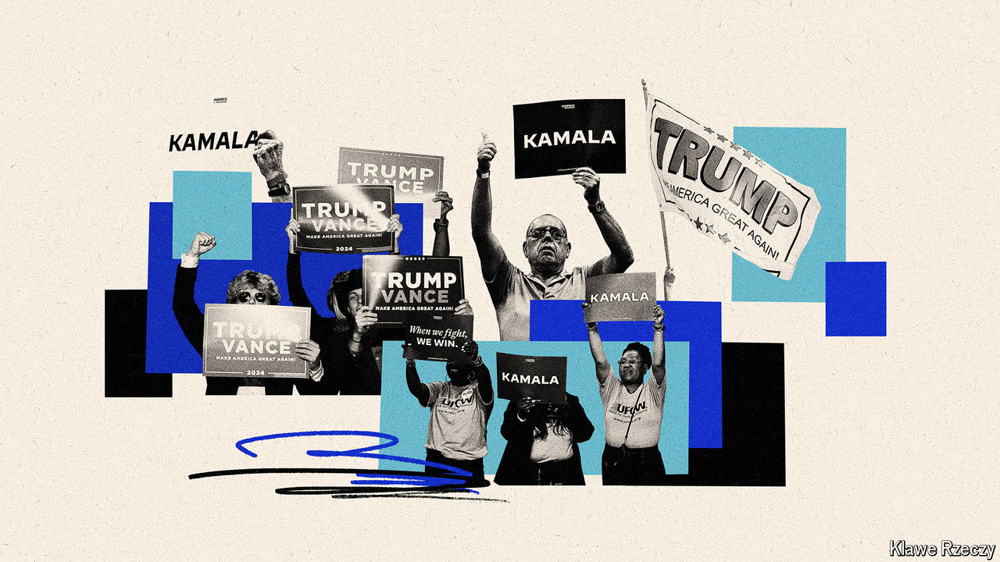

###### Nevada gets lucky

# Swing-state economies are doing just fine 

##### They would be doing even better if the Biden-Harris administration had been more cynical 

 

> Aug 4th 2024 

As we explain in , strong economic fundamentals will not be enough to propel Kamala Harris to the White House. Still, the health of the economy in the swing states should give Democrats some confidence in the final months of campaigning. Most have performed well in recent years relative to national benchmarks.

