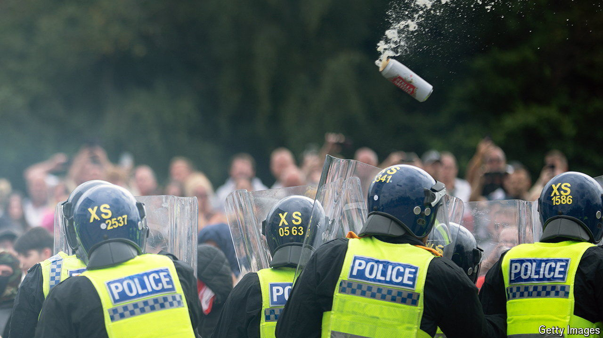

###### Attitudes to immigration

# Are Britain’s rioters representative of views on immigration? 

##### Young men chuck bricks, but the old have the sharpest views 

 

> Aug 8th 2024 

Britons tend to see the world through the monocle of social class. For Matthew Goodwin, an expert on the radical right, the  are fired by popular anger against “a new ruling class”, an “elite minority” that wants uncontrolled immigration. Tommy Robinson, a much-prosecuted demagogue, speaks of a clash between “hard-working family men” and “the establishment”. 

