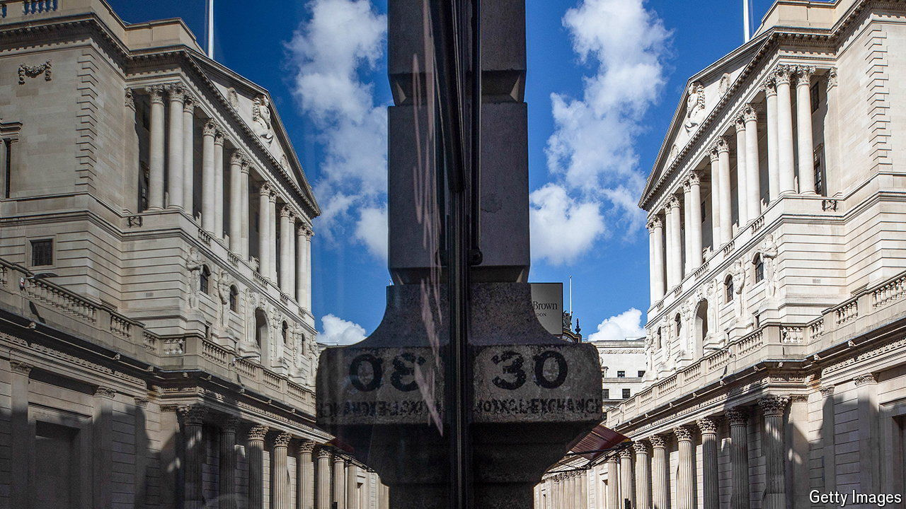

###### One weird trick

# How should Britain handle £200bn in quantitative-easing losses? 

##### An accounting fiddle could give Rachel Reeves more room to avoid tax rises 

 

> Aug 8th 2024 

Plenty of traders have lost millions on ill-timed forays into bond markets. A sorry handful have even lost billions. Losing hundreds of billions, though, is the preserve of governments. In Britain the bill for the Bank of England’s losses from its quantitative-easing (QE) programme since interest rates began to rise is projected to hit around £200bn ($254bn, 7.4% of GDP). The government’s approach to these losses, and their messy interaction with Britain’s fiscal rules, could determine whether Britons face tens of billions of pounds more in tax rises at the next budget, due for the end of October.

