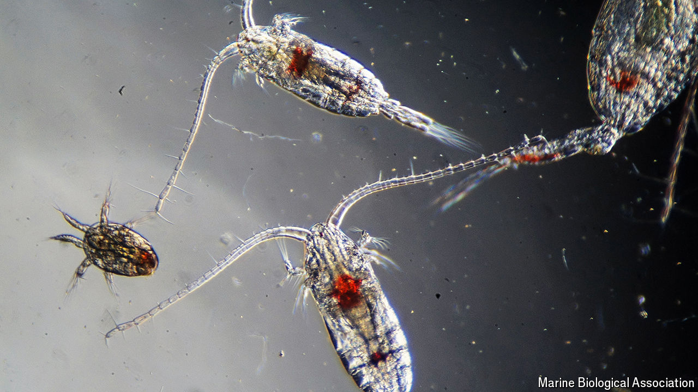

###### Sea change

# Plankton are much more interesting than you might think 

##### The world’s longest-running marine survey is based in Devon 

 

> Aug 8th 2024 

One might have been beneath the ferry that you took to France. Another could have been beneath the boat that carried the banana you ate for lunch from the Caribbean. Right now, too, somewhere in the seas, a small torpedo-shaped metal box is being towed by a boat. Wherever it is—and it might be anywhere from Svalbard to the Sargasso Sea—this box is part of the world’s longest-running marine survey. Which sounds impressive and interesting until, perhaps, you hear what is being studied—plankton.

