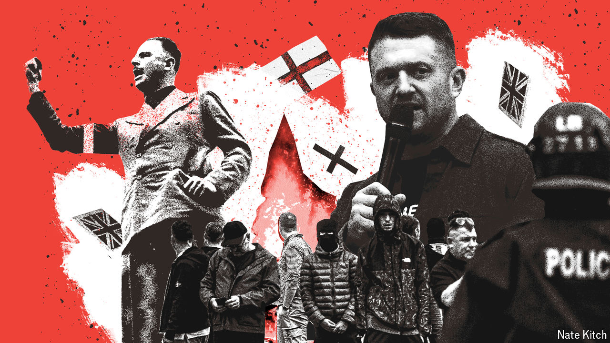

###### The haters

# The evolution of Britain’s extreme right 

##### White nationalism has become more amorphous and more online 

 

> Aug 6th 2024 

THEY BROKE through the hotel doors soon after midday on August 4th. Around 700 far-right activists had gathered outside the Holiday Inn Express in Manvers, a suburb in the deprived northern town of Rotherham, that morning. The mob chanted “get them out” and “burn it down” at asylum seekers housed inside and hurled chairs, planks and bricks at the police. Hotel staff erected barricades. One rioter started a fire in a doorway. It is remarkable no one was badly hurt.

