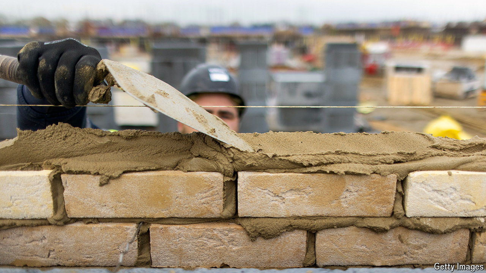

###### House-building

# Would building 1.5m homes bring down British house prices? 

##### Answer: Not by much 

 

> Aug 8th 2024 

HOMES IN Britain have become eye-wateringly expensive. When the Labour Party last won power, in 1997, the ratio of the median house price to the median income in England was 3.5. Now it is 8.3. The share of households aged under 30 who own their own home has fallen from one in five in 1997 to one in eight. On July 24th Sir Keir Starmer, the new prime minister, said that  was denying young people ”the basic dream of homeownership”. 

