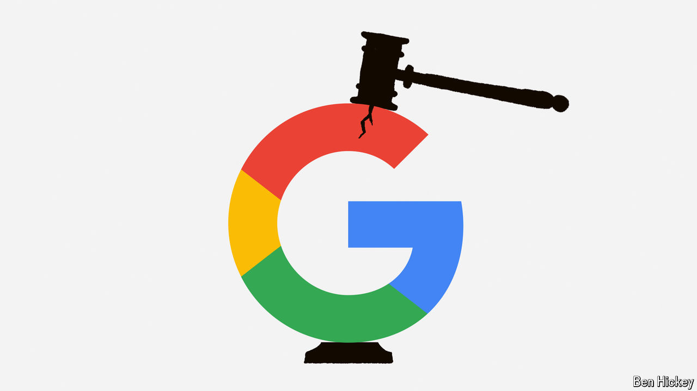

###### Searching questions

# A court says Google is a monopolist. Now what? 

##### The ruling could lead to a big-tech showdown 

 

> Aug 6th 2024 

Amid the 286-page judgment, issued after nearly four years of trial proceedings and petabytes of evidence, four words stand out. “Google is a monopolist,” wrote Amit Mehta, the judge of a district court in America, adding that “it has acted as one”. His ruling, handed down on August 5th, could lead to big changes for the multi-billion-dollar search market—and for the wider tech industry.

