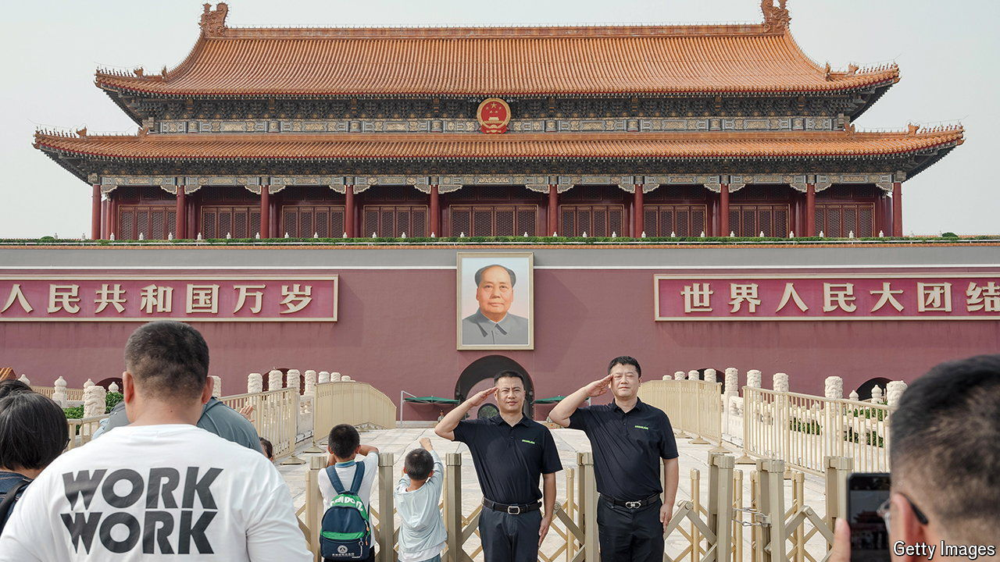

###### Code-breaking

# China is overhauling its company law 

##### Its leaders want to make business less volatile—and easier to control 

 

> Aug 8th 2024 

Last month China’s government implemented the most sweeping reform to company law in the country since the changes that were made following its accession to the World Trade Organisation in 2001. The new rules are creating yet another headache for Chinese companies grappling with overcapacity and a . For their part, China’s leaders are betting that the new law will make business in the country less volatile—and easier for the Communist Party to control.

