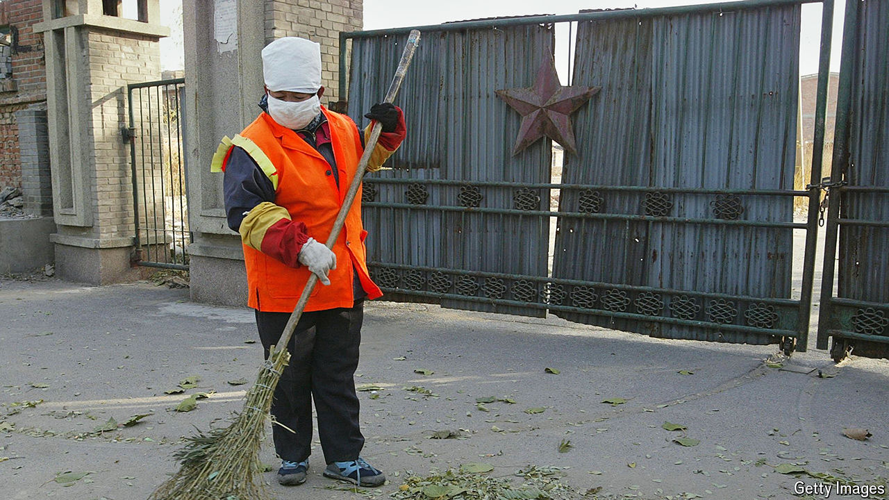

###### Industrial involution

# China’s manufacturers are going broke 

##### Overcapacity is leading to soaring bankruptcies 

 

> Aug 8th 2024 

Most news on China’s manufacturers is bad news for rivals around the world. Foreign governments fear their domestic champions will be pummelled by low-cost Chinese rivals. But on August 5th the world got a small reminder that China’s producers face big problems of their own. Hengchi, an electric-vehicle (EV) maker owned by Evergrande, a failed property developer, told investors that two of its subsidiaries had been forced into bankruptcy. The group originally aimed to sell 1m EVs a year by 2025; amid feverish competition it sold just 1,389 last year.

