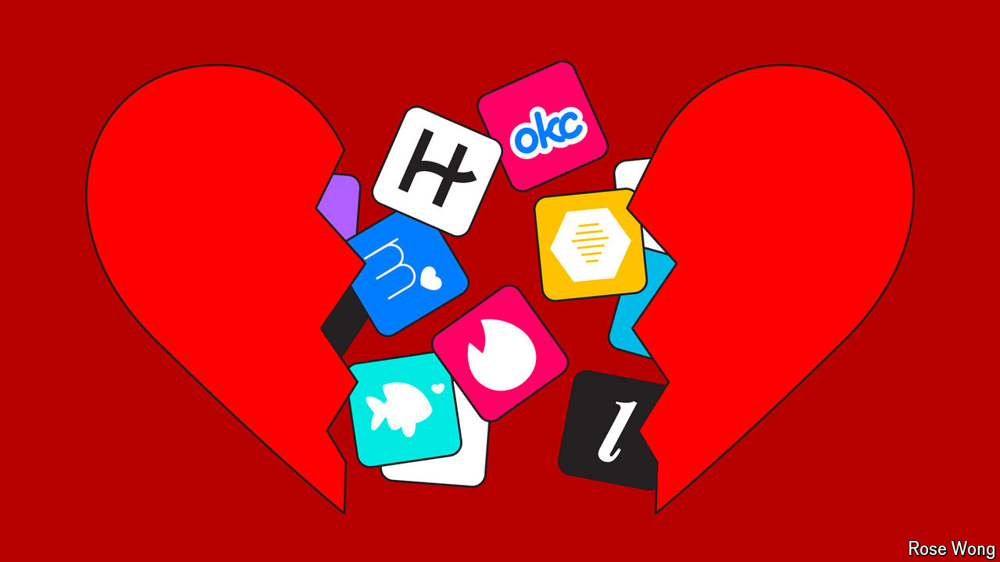

###### Swiped out

# Why people have fallen out of love with dating apps 

##### Tinder and Bumble are struggling as singles refuse to pay up 

 

> Aug 8th 2024 

When Tinder, a mobile dating app, launched on college campuses in America in 2012, it quickly became a hit. Although online dating had been around since Match.com, a website for lonely hearts, launched in 1995, it had long struggled to shed an image of desperation. But Tinder, by letting users sift through photos of countless potential dates with a simple swipe, made it easy and fun.

