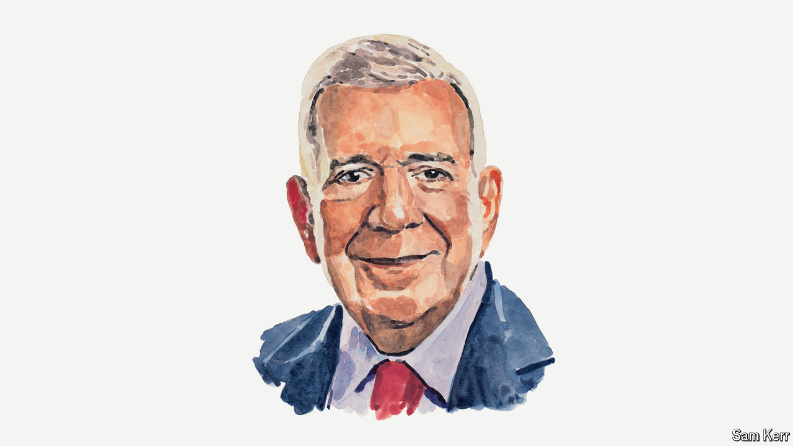

###### Venezuela

# The real winner of Venezuela’s election urges the regime to face facts 

##### A peaceful transfer of power is still possible, says Edmundo González 

 

> Aug 4th 2024 

I HAVE BEEN been a public servant of Venezuela all my life—a career diplomat whose service culminated during the presidency of Hugo Chávez as ambassador to Argentina.

