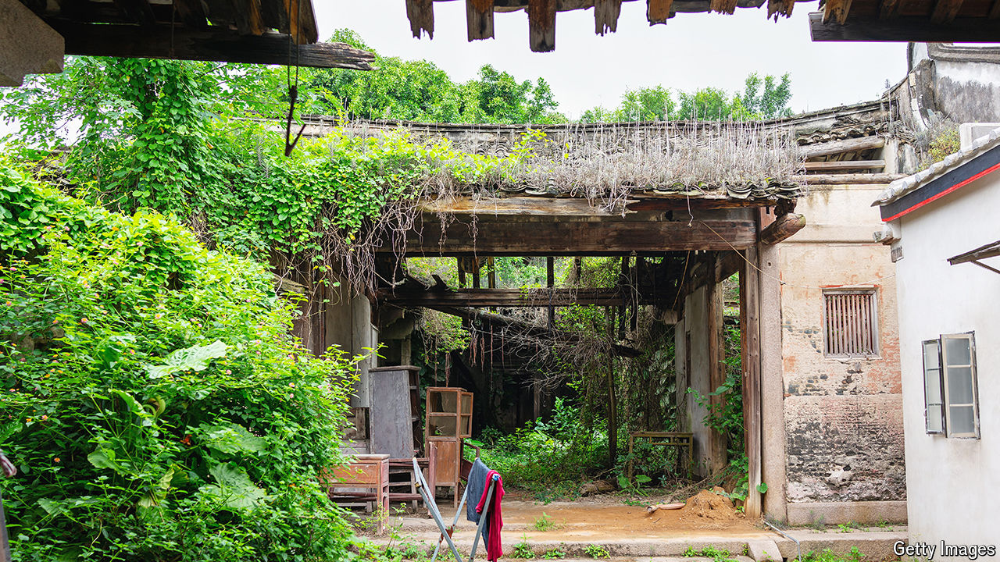

###### Selling the farm

# A reform that could turbocharge the Chinese economy 

##### Why won’t the government give farmers more freedom to sell their homes? 

 

> Aug 8th 2024 

China’s “reform and opening” policy began more than four decades ago in the countryside. It involved dismantling Mao Zedong’s disastrous “people’s communes” and giving farmers their own plots of land to tend. Food production soared, as did farmers’ incomes. Now some Chinese leaders want to disentangle rural property from a web of Mao-era restraints on ownership and let villagers enjoy another boom. The impact could be as far-reaching as those changes in the 1980s. But this time officials are proceeding more gingerly.

