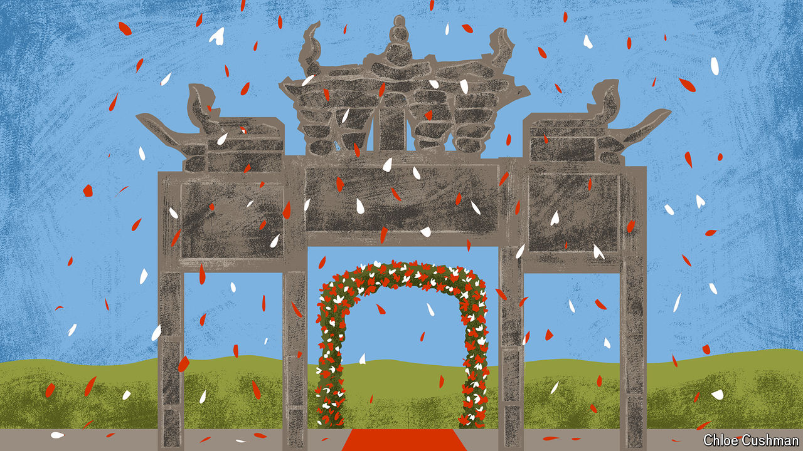

###### Chaguan

# China develops a divorced dating scene 

##### Older Chinese looking to remarry face revealing obstacles 

 

> Aug 8th 2024 

POSTERITY HAS not been kind to Widow Luo. Bereaved as a young mother in the late Qing dynasty, her refusal to remarry earned her the emperor’s praise and a —a carved stone archway commemorating her chastity. A century and a half on, Widow Luo’s arch stands forgotten, its stonework crumbling on a backstreet in Lianglu, a sleepy village in south-west China. 

