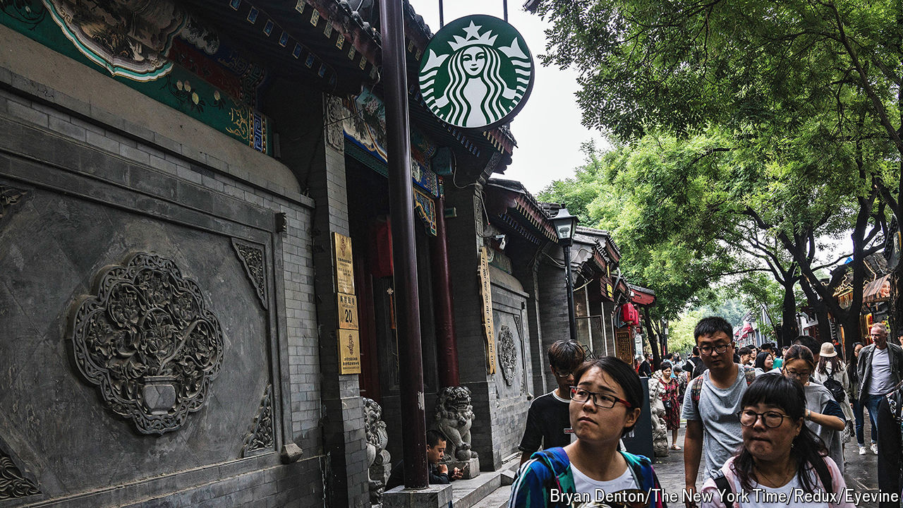

###### Increasingly caffeinated

# China is now the world leader in coffee shops 

##### But the average Chinese person still guzzles much less than a typical American 

 

> Aug 8th 2024 

The historic city of Suzhou, about an hour’s drive from Shanghai, is criss-crossed with canals. Old whitewashed buildings line the banks. A century ago some of these would have been , or traditional teahouses, where locals gathered to discuss the news or conduct business. Today a visitor is more likely to find shops serving a different kind of beverage. There are dozens of Starbucks outlets in Suzhou, as well as other coffee sellers. Some even look like old —from the outside at least.

