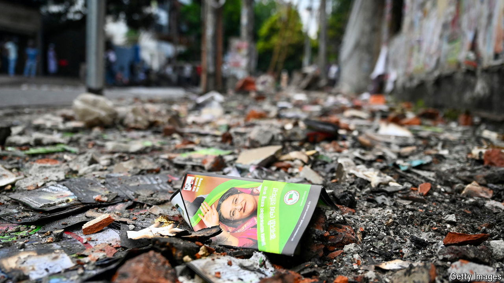

###### Revolution-coloured glasses

# How China views the popular uprising in Bangladesh 

##### The government is quiet. Others blame America 

 

> Aug 8th 2024 

Just last month Sheikh Hasina travelled to Beijing, where she met China’s leader, Xi Jinping. According to some reports, the erstwhile leader of Bangladesh cut her trip short, miffed at receiving less financial support for her country than expected. But if any foreign power deserves blame for the uprising that forced Sheikh Hasina to flee Bangladesh on August 5th, it is America, suggest Chinese state media. The , a nationalist tabloid, cites experts speculating about Western involvement in the chaos.

