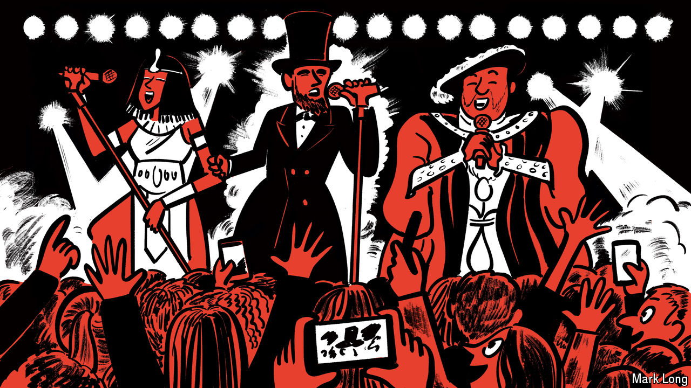

###### The best of times is now

# History podcasts are booming 

##### Why listening to stories about the past are a present pastime 

 

> Aug 6th 2024 

If you think history is old hat, try getting a seat at the Royal Albert Hall on October 18th. The soirée at London’s most famous concert venue sold out in May. Some 5,000 people will enjoy a bit of Mozart and Beethoven; the big draw, however, is a pair of chatty historians. 

