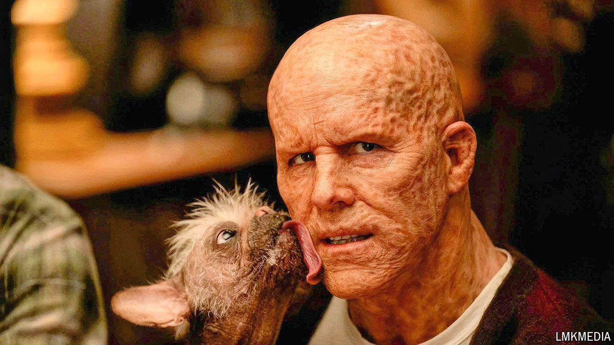

###### Gross-out

# “Deadpool & Wolverine” is revolting, but popular 

##### The film has had the highest-grossing opening of an R-rated film 

 

> Aug 2nd 2024 

What is the most surprising thing about the new Marvel film, “Deadpool &amp; Wolverine”, the first to be rated R? It is not the violence, which is gratuitous and unpleasantly tinged with sexuality (suffice to say that Wolverine’s claws go where no claws should). Instead, it may be the synopsis, which Disney released beforehand. This starts by explaining how the hero, Deadpool, must save the world from “an existential threat” then suddenly tails off. “Fuck,” it says. “Fuck. Synopses are so fucking stupid.”

