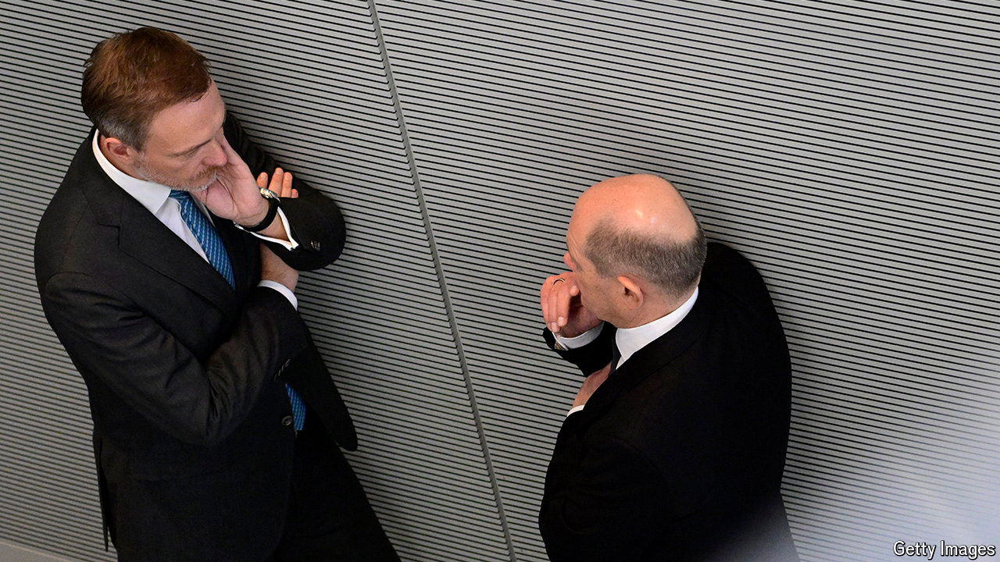

###### Flatlining

# Can anything rouse Germany from its economic slumber? 

##### Politicians are more interested in trivial budget rows than finding sources of growth 

 

> Aug 8th 2024 

PITY THE the leading lights of Germany’s government. Last month they struck an eleventh-hour deal for next year’s budget, narrowly averting the collapse of their three-party coalition. Now it is all unravelling. Experts convened by Christian Lindner, the finance minister and leader of the fiscally hawkish Free Democrats, concluded that accounting tricks in the draft budget designed to circumvent Germany’s deficit-limiting “debt brake” risk falling foul of the constitutional court. 

