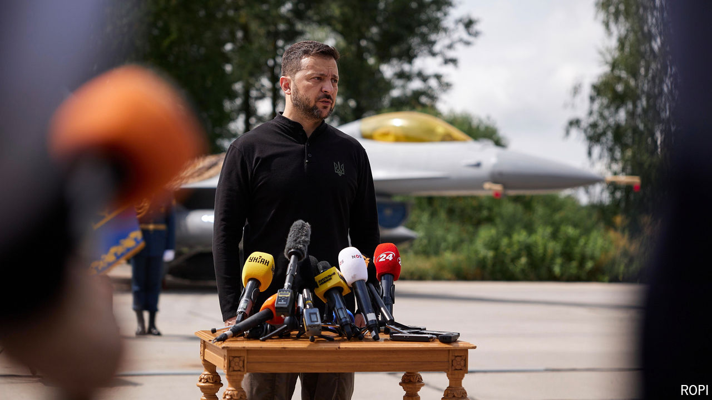

###### Late arrival

# How much of a difference will Ukraine’s new F-16s make? 

##### Too few to beat Russia’s air force, but a strong symbolic start 

 

> Aug 4th 2024 

BETTER LATE than never. Since the start of Russia’s full-scale invasion in February 2022, Volodymyr Zelensky, Ukraine’s president, has been . The first ten (of an eventual 79) arrived in Ukraine on the last day of July, a year after the reluctant Biden administration finally gave its more eager European allies  to send them. By the end of 2024, Ukraine should be flying 20 of the American-made fighter jets. The rest, promised by the so-called  led by Denmark and the Netherlands, will arrive in batches during 2025.

