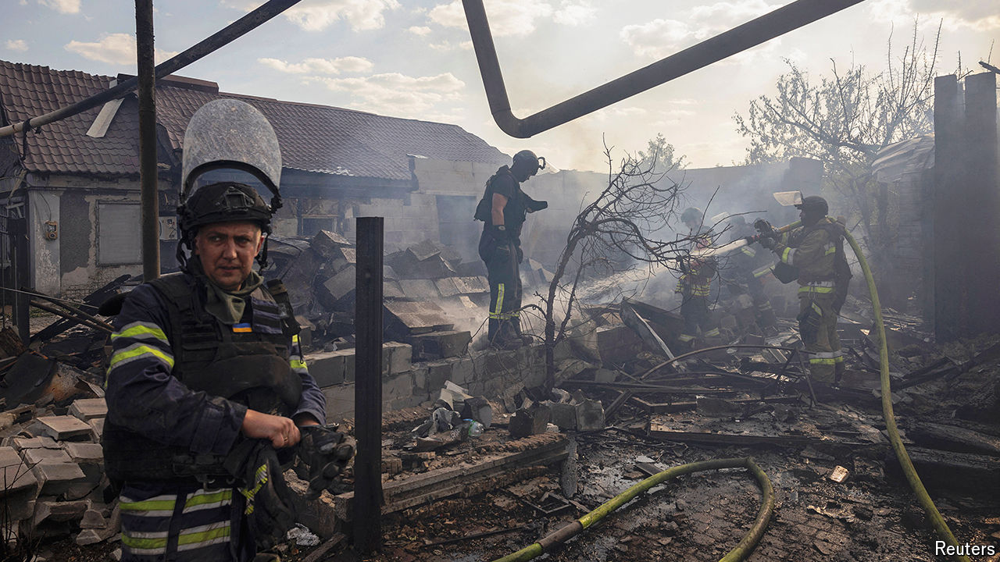

###### Pushing hard

# Russia’s bloody summer offensive is hurting Ukraine 

##### Kremlin troops are making gains in the Donbas region 

 

> Aug 6th 2024 

FOR THOSE arriving on the lunar, pockmarked terrain of Ukraine’s eastern front lines, life is often short. “The experienced soldiers fear getting to know the newcomers,” says “Artem”, a soldier once attached to the 59th brigade south of Pokrovsk, in the province of Donetsk. “Your fate is decided in the first few hours. Five, ten minutes, that’s really all it takes.”

