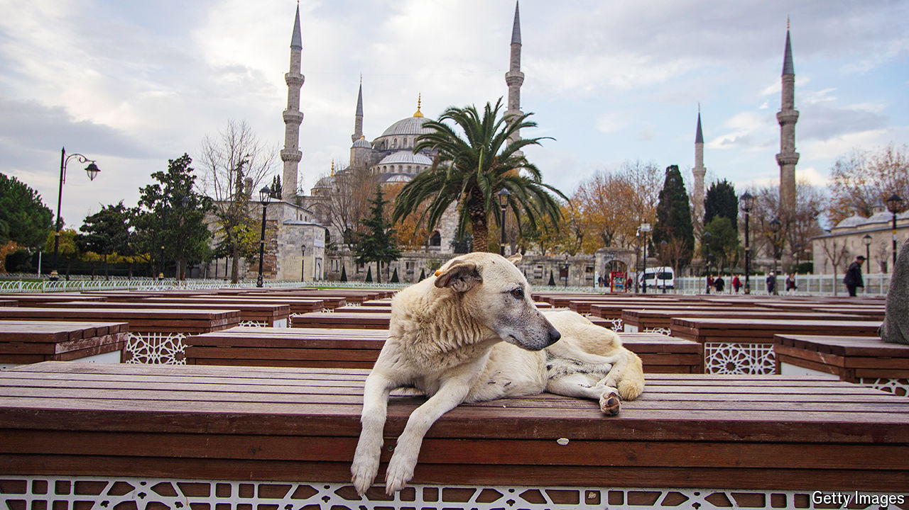

###### Dog gone

# Turkey’s president refuses to let sleeping dogs lie 

##### Stray dogs are being rounded up 

 

> Aug 8th 2024 

Stray dogs have been a fixture of Turkey’s cities for centuries. Butchers ply them with scraps, pensioners offer them water, while others use boxes fitted with blankets to shield them from the winter cold. The strays are chipped, vaccinated and spayed by local vets.

