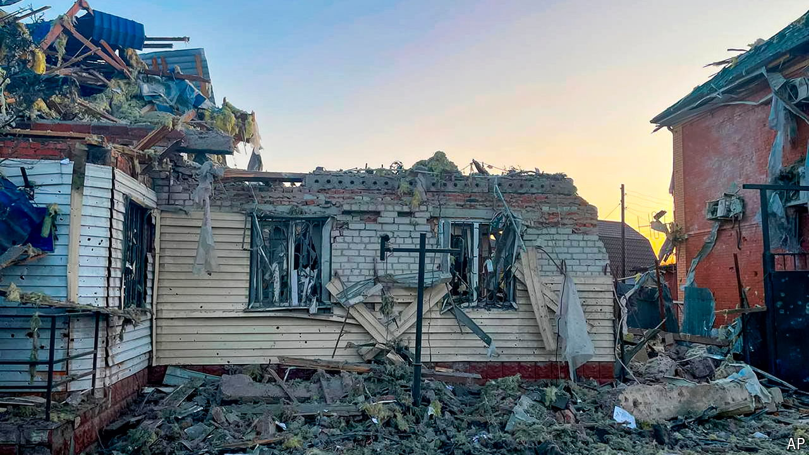

###### Shell and shock

# Ukraine surprises with a high-stakes raid into Russia 

##### The second battle of Kursk is raging 

 

> Aug 8th 2024 

THREE DAYS in, Ukraine’s unexpected cross-border raid into Russia’s Kursk region to the north-east shows no signs of abating. Since the start of the operation on the morning of August 6th, Russia has lost full control of at least 350 sq km of its territory. Scores of its soldiers have been killed or captured. A race is on to halt the advance—and prevent the Ukrainians from digging in. 

