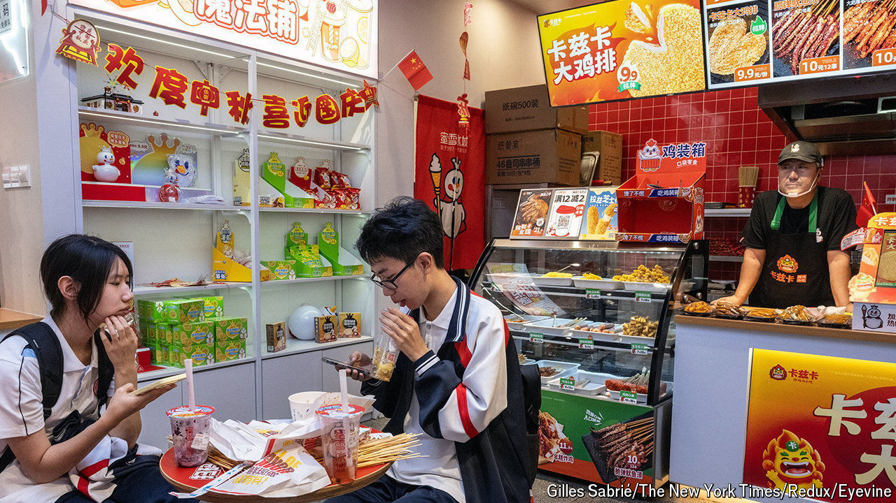

###### Sour taste

# How Chinese shoppers downgraded their ambition 

##### The trend will dismay the country’s policymakers 

 

> Aug 8th 2024 

“Even those born poor fear the heat.” This slogan, printed on a lemonade from Mixue, a drinks-and-ice-cream chain, says a lot about Chinese consumption. The beverage has been a wild success during a heatwave sweeping the country, less for its tart, refreshing properties than for its price. A cup sells for as little as 3.6 yuan ($0.50), compared with 15 yuan for milk tea. Its popularity, bloggers speculate, reflects darkening consumer sentiment and growing stinginess. Consumers are rapidly trading down, from higher-cost goods to cheap substitutes, and many want to squeeze out every last drop of their spending power. 

