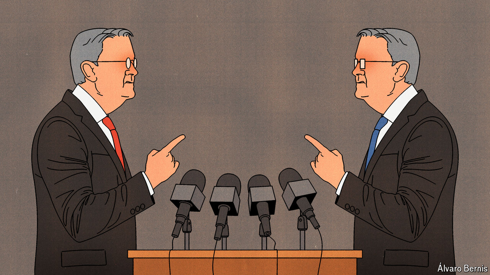

###### Free exchange

# Should central bankers argue in public? 

##### Division is not always a weakness 

 

> Aug 8th 2024 

Jerome Powell’s tenure as chairman of the Federal Reserve has been admirably sure-footed. But on July 31st he may have stumbled when he announced that interest rates would remain at 5.25-5.5%. This was soon followed by unexpectedly weak employment data. Markets around the world then plunged as investors worried that the Fed had fallen behind the curve. 

