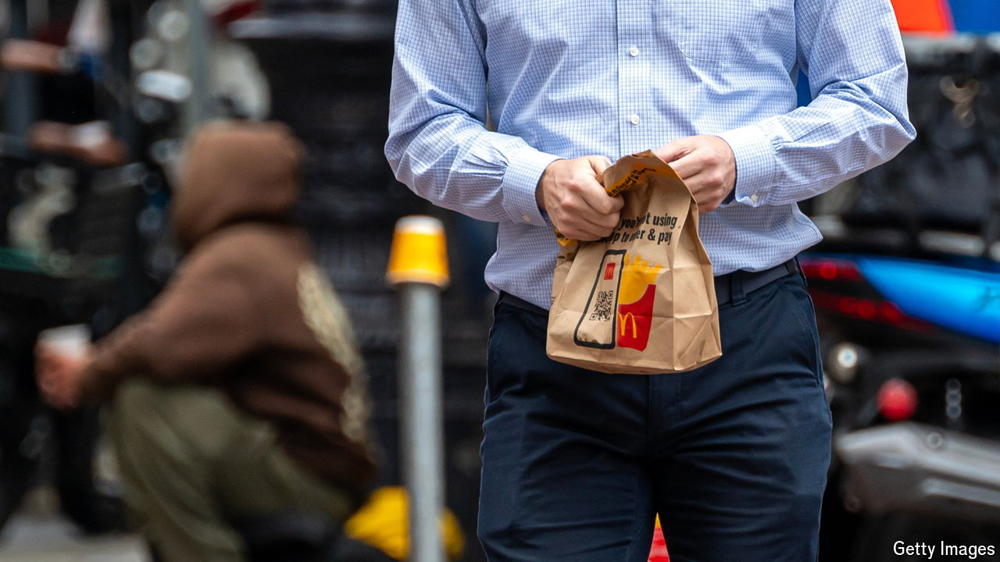

###### Burgernomics

# The Big Mac index: where to buy a cheap hamburger 

##### Meat-eaters may want to avoid Argentina 

 

> Aug 7th 2024 

McDonald’s owed its early success to zealous pickiness. Other restaurant chains in the 1960s had similar rules for food preparation and cleanliness. But none enforced them as rigorously, according to “McDonald’s: Behind the Arches”, a history of the company by John Love. 

