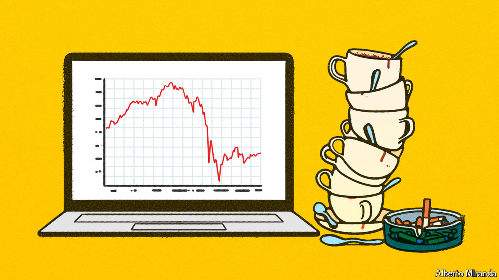

###### Cigarettes, coffee and panic

# The stockmarket rout may not be over 

##### As investors pause for breath, we assess what could turn a correction into a crash 

 

> Aug 6th 2024 

For a while on August 5th things were looking truly awful. During the Asian trading session  share index had fallen by 12%, marking its worst day since 1987. Stocks in South Korea and Taiwan had tanked by 9% and 8% respectively, and European markets were faltering. Before trading began in America, the VIX index, which measures how wildly traders expect share prices to swing, was at a level it had reached only early during the covid-19 pandemic and after Lehman Brothers collapsed in 2008 (see chart 1). Ominously, though gold is usually a hedge against chaos, its price was falling—suggesting that investors might be selling assets they would rather hold on to in order to stay afloat. The previous week’s rout in global markets seemed to be spiralling into a full-blown crisis.

