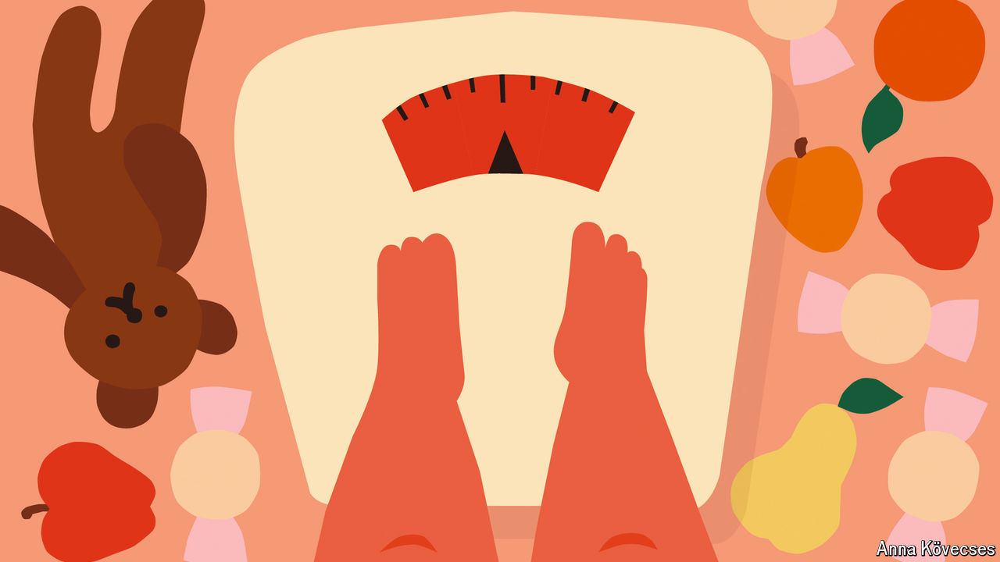

###### Tipping the balance

# Why the war on childhood obesity is failing 

##### Sugar taxes and obesity drugs will not be enough 

 

> Aug 8th 2024 

SUZIE JIMENEZ cried as she waited in the car park. Her 14-year-old son was in the emergency department, suffering from stomach pains. He felt humiliated when doctors in Austin, Texas, told him that because of his bigger body he would need to have a CT scan rather than an ultrasound. He was scared to tell them he weighed 360 pounds (163kg). A shortage of Wegovy had meant that despite being approved for the weight-loss drug, he had not yet been able to start it. Ms Jimenez, at times the sole breadwinner for her family of five, says they sometimes ate fast food for “comfort”. 

