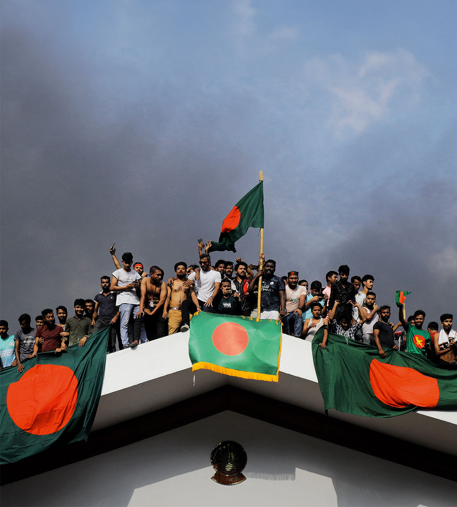

###### People power

# Bangladesh has ousted an autocrat. Now for the hard part 

##### A caretaker leader, Muhammad Yunus, must try to rebuild democracy 

 

> Aug 8th 2024 

As exits GO, it was dramatic. On August 5th Sheikh Hasina, the prime minister of Bangladesh, fled the country she has ruled with an increasingly harsh grip since 2009. She was driven out by a vast display of people power on the streets of Dhaka, the capital, and will be replaced by a caretaker government, backed by the army and led by , a Nobel peace laureate. Like him, many Bangladeshis are calling it a “second liberation”, half a century after independence. 

