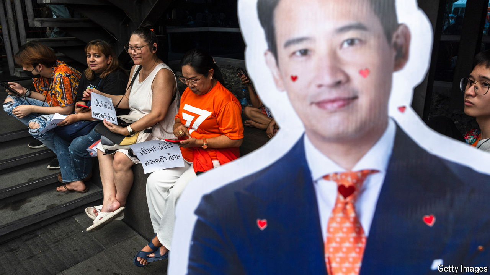

###### A desperate dissolution

# Banning the opposition won’t save Thailand’s unpopular regime 

##### Once again, the army pretends its critics are anti-royal 

 

> Aug 7th 2024 

Thailand’s law against insulting the monarchy is arguably the world’s strictest. Each insult is punishable by three to 15 years in prison, and what counts as rude is broadly defined. People have been charged for such things as wearing a crop top similar to the king’s, throwing dog food at the police (implying they are the king’s attack dogs) and questioning whether an exclusive contract to manufacture covid-19 vaccines should have been awarded to a royal-owned firm. 

