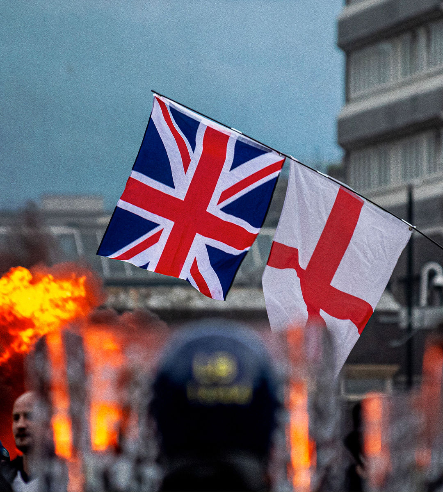

###### A week of violence

# How to respond to the riots in Britain 

##### Punish the thugs. Stand up for immigration. And improve local services 

 

> Aug 8th 2024 

Repulsive is a strong word. It is not strong enough for the behaviour . Ever since three little girls were slain in  on July 29th, indefensible anti-immigration protests have flared across towns and cities in England and Northern Ireland. Mosques and police officers have been attacked. In Rotherham criminals tried to set fire to a hotel they thought was housing asylum-seekers. Thugs in the streets have been egged on by hatemongers online. 

