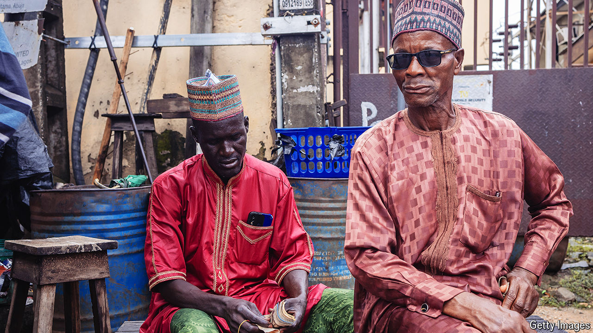

###### Glass half full

# Why Ethiopia and Nigeria must press on with reforms 

##### Currency liberalisation alone is not enough 

 

> Aug 8th 2024 

For YEARS Nigeria and Ethiopia, sub-Saharan Africa’s second- and third-biggest economies, defied the market orthodoxy embraced elsewhere on the continent. But . Barely a year into his term, Bola Tinubu, Nigeria’s president, has twice let the naira depreciate. At the end of July, meanwhile, Ethiopia floated the birr and received an IMF programme as a reward. In both countries reform-minded technocrats are now at the helm of the central bank. 

