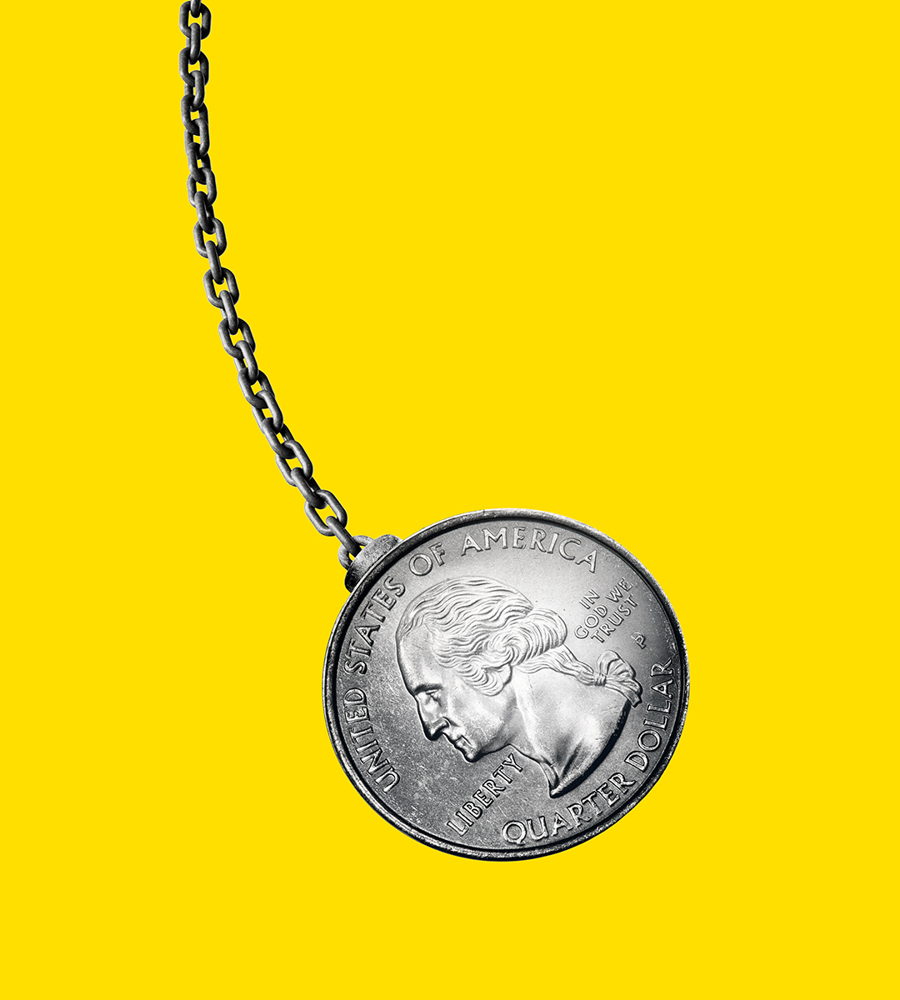

###### Growth scares

# Will America’s economy swing the election? 

##### It is not entering recession, but it is slowing down. That is bad news for Kamala Harris 

 

> Aug 8th 2024 

AMERICA’S VOTERS have not given credit to the Biden White House for their country’s economic boom. Will they  for a bust? After growing at rates that were the envy of the rich world, the American economy now seems to be slowing. Investors are worried that a  is just around the corner. On August 2nd, following a disappointing survey of manufacturers and a rise in claims for jobless benefits, they took fright at the news that the country’s unemployment rate had risen to 4.3% in July, its highest since 2021. On August 5th  worldwide, before recovering a little lost ground the next day.

