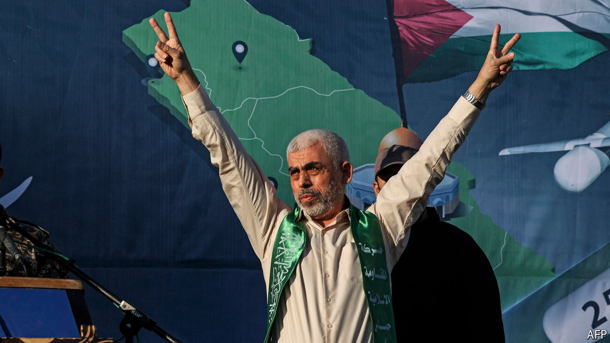

###### Up with extremism

# Hamas’s pick of Yahya Sinwar as leader makes a ceasefire less likely 

##### The appointment of the architect of October 7th ties the group closer to Iran 

 

> Aug 6th 2024 

IF THERE WAS ever any doubt over where the balance of power lay within Hamas, it was surely vanquished on August 6th when the militant group named Yahya Sinwar, its leader in Gaza and the architect of the October 7th attacks, as its supreme leader. The appointment sends a clear signal that Hamas’s most extreme faction is now in charge. This dims hopes of a ceasefire that might end a war that has already claimed nearly 40,000 Gazan lives.

