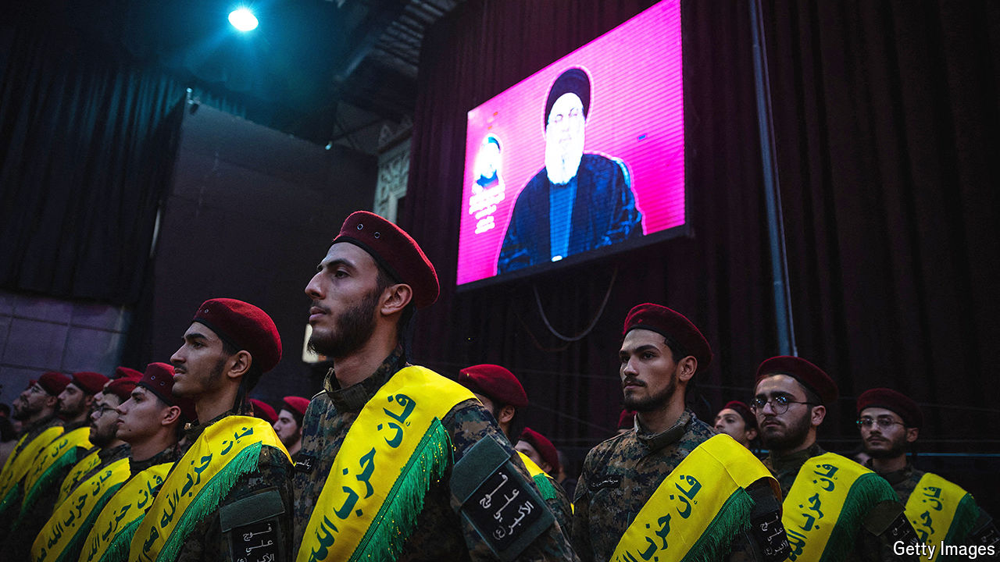

###### Iran v Israel

# Iran’s frightening new playbook for war 

##### It is abandoning the restraint that has prevented open conflict with Israel 

 

> Aug 8th 2024 

THE SUBURBS south of Beirut are emptying as residents flee to the mountains. Airlines are cancelling flights to Beirut, Tehran and Tel Aviv. Civilians in Lebanon are filling their cars with petrol; stressed-out Israelis are ordering more fast food. The Middle East has been on tenterhooks for more than a week, awaiting the latest escalation in ten months of fighting between Israel, Iran and its militant allies. As  went to press, that escalation had yet to happen—but much of the region expects it will in the coming days.

