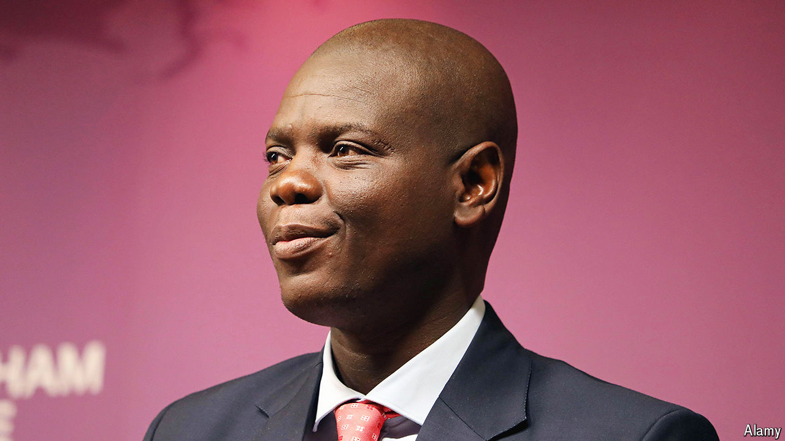

###### Swinging back to the centre

# South Africa’s foreign minister wants better relations with the West 

##### Ronald Lamola’s view counts: he may be the next president 

 

> Aug 8th 2024 

Since the general election of May 29th South Africa has been asking how long its new government of national unity (GNU) will last. The 11-party pact, anchored by the African National Congress (ANC) and the ex-opposition, the Democratic Alliance (DA), came about because the ANC lost its parliamentary majority for the first time. Despite some bickering, the two main parties in the union seem keen to stick it out, at least for a while. 

