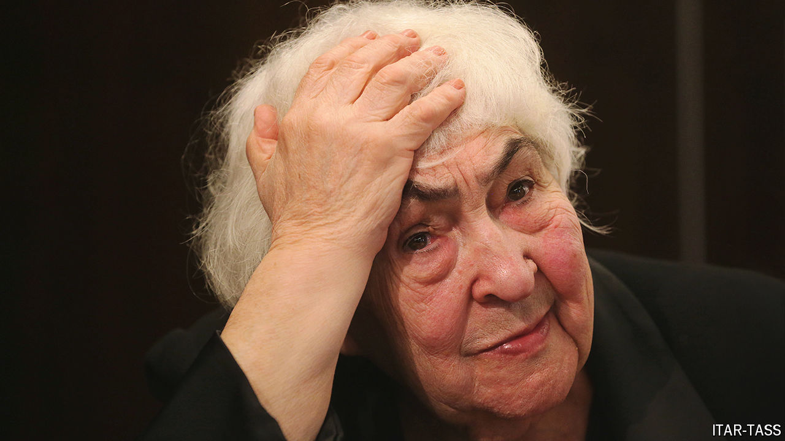

###### Out of Stalin’s terror

# Inna Solovyova studied both stagecraft and the Russian soul 

##### The historian of the Moscow Art Theatre died on May 29th, aged 96 

 

> Aug 8th 2024 

In her last months and weeks, with many of her students out of Russia because of its war against Ukraine, Inna Solovyova lay bed-bound in her Moscow flat, on the third floor of a grey Soviet block on a hill above the Setun river. Her body might be useless, especially her eyes, but her mind was clear as ever. In easier days she had guided companions round Moscow for hours, tirelessly pointing out churches from the age of Boris Godunov or buildings where Anton Chekhov’s Three Sisters might have lived. When she crossed the roads, with her stout, forceful figure and her purposeful step, cars slowed down; and when she went to a favourite restaurant, a cheap, honest eatery tucked away behind the Lenin library, the drivers waiting for their bosses would straighten up, as though to attention. Now her surroundings were reduced to shelves of old volumes and the tick of a Baroque clock. 

