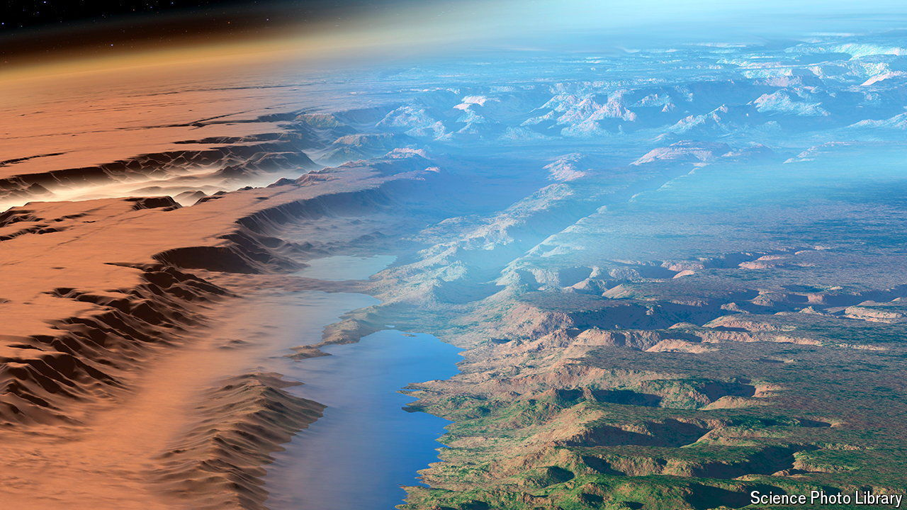

###### Terraforming Mars

# Engineered dust could help make Mars habitable 

##### Restoring water on Mars may be easier than you think 

 

> Aug 7th 2024 

IF YOU WANT to live elsewhere in the solar system, Mars is the least-bad choice. These days, the planet is a frigid, poison-soaked desert. But as the dry river valleys that cross its surface suggest, things were balmy enough in the past to allow liquid water. 

